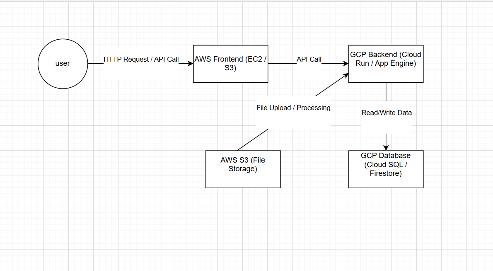

# 🌐 Multi-Cloud Architecture (AWS + GCP)

This project demonstrates a **multi-cloud architecture** where services are distributed across **AWS** and **GCP**.  
The goal is to show **interoperability between platforms** using a frontend hosted on AWS and a backend API hosted on GCP.  

---

## 📌 Architecture Overview

- **AWS (Frontend)**  
  - Hosts a static website (`index.html`).  
  - Acts as the **entry point** for users.  
  - Sends API requests to the GCP backend.

- **GCP (Backend)**  
  - Runs a **Flask API** (`app.py`).  
  - Processes requests from AWS frontend.  
  - Connects to a database (Cloud SQL / Firestore).  

---

## 🖼️ Architecture Diagram

---

## ⚙️ Project Structure

